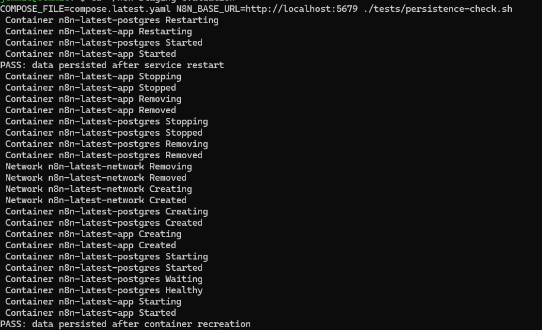
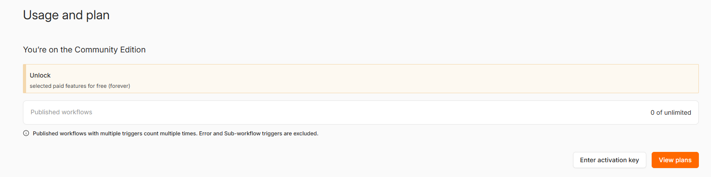

# n8n Isolated Staging Evaluation

Isolated evaluation framework for Task #5290, covering clean n8n baseline validation, regression and persistence testing, and a read-only compatibility assessment of the MatrixForgeLabs development licence-bypass patch.

## Outcome

The clean n8n `2.36.7` environment passed all completed functional, credential-storage and persistence tests.

The separate clean n8n `2.38.7` follow-up environment also passed health, exact-version, service-restart and container-recreation persistence checks. Its Usage and plan page confirmed that it remains on the Community Edition.

Static analysis confirmed that the supplied patch targets n8n `1.119.0`. Compatibility with n8n `2.36.7` is not established, so the patch was not applied to the validated baseline.

## Patch Assessment

The MatrixForgeLabs repository was reviewed without executing its scripts or modifying the clean environment.

| Item | Value |
|---|---|
| Reviewed commit | `4e69096875a618d894a11b995c5658214f400e68` |
| Patch SHA-256 | `d2f4fd8cb4bcfaeed6dc7fb1e5e65885b96ce549993d48dcfe7566ecf634d6b` |
| Documented patch target | n8n `1.119.0` |
| Validated baseline | n8n `2.36.7` |
| Review method | Read-only static analysis |

### Version Compatibility

The patch documentation identifies n8n `1.119.0` as compatible. The validated environment uses n8n `2.36.7`; therefore, compatibility across this major-version difference cannot be assumed.


### Modified Components

The patch changes seven areas across the backend, frontend and build configuration:

- Backend logging
- ESLint configuration
- Core licence management
- Enterprise UI rendering
- Frontend feature settings
- TypeScript declarations
- pnpm workspace dependencies


### Security and Stability Findings

| Finding | Impact |
|---|---|
| Development-mode fallback | Bypass may activate without the explicit flag |
| Fake licence manager | Standard entitlement validation is replaced |
| Unlimited quota overrides | Normal product limits are removed |
| Fake management JWT | Dependent services may reject invalid licence data |
| Frontend proxy | Features may appear enabled without backend support |
| Broad `any` casts | Type incompatibilities may surface only at runtime |
| Dependency changes | Build reproducibility and maintenance risk increase |
| Major-version mismatch | Patch conflicts or silent failures may occur |


### Integrity Verification

The patch was fingerprinted using SHA-256. `git status --short` returned no output, confirming that the cloned review source remained unchanged.


## Assessment Status

| Area | Result |
|---|---|
| Patch compatibility assessment | Completed |
| Patch integrity verification | Completed |
| Isolated Docker deployment | Passed |
| n8n 2.36.7 upgrade | Passed |
| Core workflow execution | Passed |
| HTTP Request and JavaScript nodes | Passed |
| Webhook processing | Passed |
| Credential storage validation | Passed |
| Restart and recreation persistence | Passed |
| Patch execution | Not performed |
| Enterprise-feature validation | Not verified |
| Before-and-after comparison | Outstanding |
| Separate n8n 2.38.7 validation stack | Passed |
| n8n 2.38.7 service restart persistence | Passed |
| n8n 2.38.7 container recreation persistence | Passed |
| n8n 2.38.7 edition status | Community Edition confirmed |

## Environment

| Component | Configuration |
|---|---|
| Host | Windows with WSL2 Ubuntu |
| Runtime | Docker Desktop |
| Deployment | Docker Compose |
| n8n | 2.36.7 |
| Database | PostgreSQL 16 Alpine |
| Network binding | `127.0.0.1:5678` |
| Persistence | Named Docker volumes |
| Test data | Dummy data only |
| Production impact | None |

Docker Compose was selected because the task permits Docker or Nomad and provides sufficient isolation for this evaluation.

## Latest-Version Follow-up

`compose.latest.yaml` provides a second, non-destructive n8n `2.38.7` baseline for the manager-approved compatibility follow-up. It does not replace or alter the validated `2.36.7` environment.

The follow-up stack uses:

- port `127.0.0.1:5679`;
- separate container names;
- separate PostgreSQL and n8n volumes;
- a separate Docker network; and
- dummy data only.

No licence-bypass settings or patch files are included. Enterprise testing still requires an authorised licence or an authorised test artifact supplied by the company.

The follow-up stack was executed successfully. PostgreSQL reported healthy, the n8n health endpoint returned successfully, the running version was confirmed as `2.38.7`, and data persisted after both service restart and container recreation.

## Baseline Validation

### Isolated Deployment


### Community Edition Baseline


### Core Workflow

The HTTP Request and JavaScript transformation workflow completed successfully.


### Webhook Processing

The webhook received and processed the test payload successfully.


### Upgrade and Persistence

The environment was upgraded to n8n `2.36.7`. Health, service-restart and container-recreation persistence checks passed.


### Latest-Version Validation

The isolated n8n `2.38.7` follow-up passed health, version and persistence checks.



The Usage and plan page confirmed that the clean follow-up remains on the Community Edition; Enterprise features were not activated.



## Deliverables

- `compose.yaml` — isolated Docker deployment
- `compose.latest.yaml` — separate latest-version validation deployment
- `tests/health-check.sh` — automated health validation
- `tests/persistence-check.sh` — restart and recreation validation
- `tests/version-check.sh` — exact n8n version validation
- `tests/latest-check.sh` — latest-stack health and version validation
- `workflows/baseline-workflows.json` — reusable test workflows
- [`patch-review/static-analysis.md`](patch-review/static-analysis.md) — detailed patch findings
- [`reports/evaluation-report.md`](reports/evaluation-report.md) — evaluation report
- `evidence/` — supporting technical evidence

## Run

Start and verify the environment:

```bash
docker compose config --quiet
docker compose up -d
docker compose ps
curl -fsS http://localhost:5678/healthz
```

Open n8n:

```text
http://localhost:5678
```

Run the automated checks:

```bash
./tests/health-check.sh
./tests/persistence-check.sh
```

Start and validate the separate latest-version baseline:

```bash
docker compose -f compose.latest.yaml config --quiet
docker compose -f compose.latest.yaml up -d
./tests/latest-check.sh
```

Open it at:

```text
http://localhost:5679
```

Run its persistence test:

```bash
COMPOSE_FILE=compose.latest.yaml \
N8N_BASE_URL=http://localhost:5679 \
./tests/persistence-check.sh
```

Stop only the latest-version stack without deleting its data:

```bash
docker compose -f compose.latest.yaml down
```

Stop without deleting persistent data:

```bash
docker compose down
```

> Do not run `docker compose down -v` unless permanent deletion of the test volumes is intended.

## Conclusion

The isolated n8n `2.36.7` baseline passed all completed health, workflow, credential-storage, regression and persistence tests. The separate clean n8n `2.38.7` follow-up also passed health, version, restart and container-recreation persistence checks and was confirmed as Community Edition.

The supplied patch targets n8n `1.119.0` and introduces material compatibility, security and maintenance risks. Patch execution, Enterprise-feature validation and the final before-and-after comparison remain outstanding.
