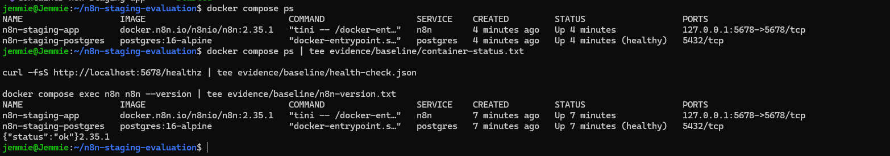
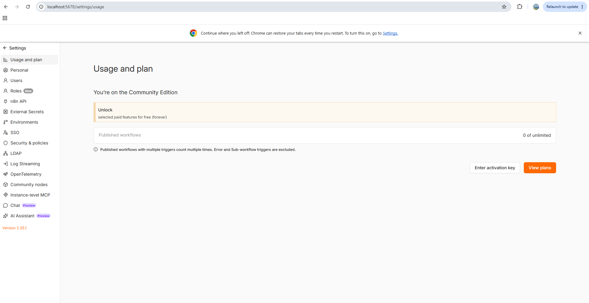
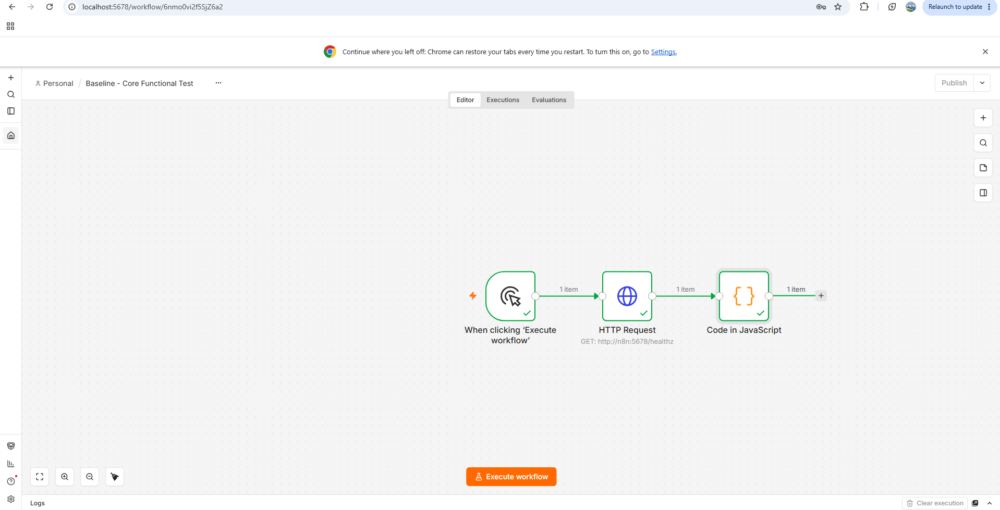
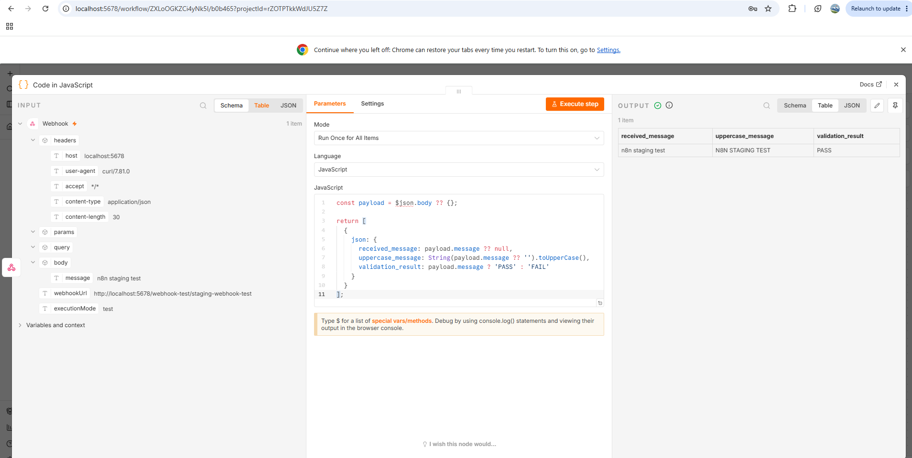
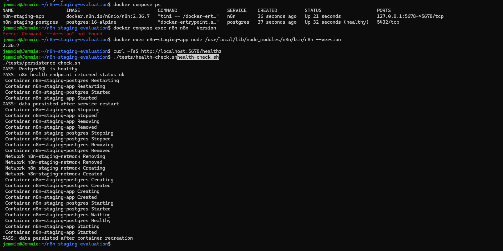

# n8n Isolated Staging Evaluation

Isolated testing framework for Task #5290, covering n8n baseline validation, regression testing, persistence, and static assessment of the MatrixForgeLabs development licence-bypass patch.

## Objective

Evaluate the unofficial patch in an isolated internal environment, verify Enterprise-feature activation, and identify compatibility, security, and maintenance risks without affecting production.

## Assessment Status

| Area | Status |
|---|---|
| Isolated Docker environment | Passed |
| n8n 2.36.7 upgrade | Passed |
| Core workflow execution | Passed |
| HTTP Request and JavaScript nodes | Passed |
| Webhook processing | Passed |
| Credential storage validation | Passed |
| Restart and recreation persistence | Passed |
| Patch documentation review | Completed |
| Patch execution | Not performed |
| Enterprise-feature validation | Not verified |

## Environment

| Component | Configuration |
|---|---|
| Host | Windows with WSL2 Ubuntu |
| Runtime | Docker Desktop |
| Deployment | Docker Compose |
| n8n | 2.36.7 |
| Database | PostgreSQL 16 Alpine |
| Exposure | `127.0.0.1:5678` |
| Persistence | Named Docker volumes |
| Test data | Dummy data only |
| Production impact | None |

Docker Compose was selected because the task permits Docker or Nomad and it provides sufficient isolation for this evaluation.

## Validation Evidence

### Isolated Baseline



### Community Edition Baseline



### Core Workflow

The HTTP Request and JavaScript transformation workflow completed successfully.



### Webhook Processing

The webhook received and processed the test payload successfully.



### Upgrade and Persistence

The environment was upgraded to n8n `2.36.7`. Health, restart, and container-recreation persistence checks passed.



## Patch Assessment

The supplied `PATCH_README.md` and described source changes were reviewed. The patch reportedly:

- Replaces the standard backend licence manager.
- Forces frontend Enterprise feature flags.
- Uses backend and frontend environment variables.
- Requires a custom n8n source build.
- May require maintenance after n8n upgrades.

The unofficial patch was not applied; therefore, Enterprise-feature activation remains unverified.

Identified risks include licensing and compliance exposure, unsupported custom builds, accidental non-test activation, frontend/backend inconsistencies, supply-chain exposure, and ongoing upgrade maintenance.

See [`patch-review/static-analysis.md`](patch-review/static-analysis.md) for the detailed assessment.

## Project Deliverables

- `compose.yaml` — isolated Docker deployment
- `tests/health-check.sh` — health validation
- `tests/persistence-check.sh` — persistence testing
- `workflows/baseline-workflows.json` — reusable workflows
- `reports/evaluation-report.md` — evaluation report
- `evidence/` — supporting evidence

## Run

```bash
docker compose config --quiet
docker compose up -d
docker compose ps
curl -fsS http://localhost:5678/healthz
```

Open:

```text
http://localhost:5678
```

Run the automated checks:

```bash
./tests/health-check.sh
./tests/persistence-check.sh
```

Stop without deleting persistent data:

```bash
docker compose down
```

> Do not run `docker compose down -v` unless permanent deletion of the test volumes is intended.

## Conclusion

The isolated n8n `2.36.7` baseline passed all completed health, workflow, credential-storage, regression, and persistence checks. Patch documentation and operational risks were assessed, while patch execution and Enterprise-feature validation remain outstanding.