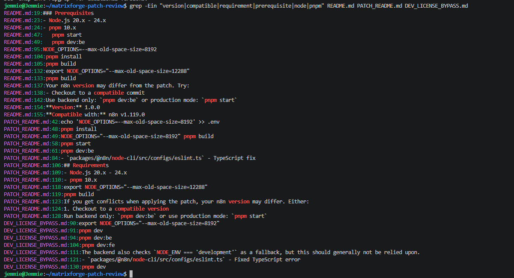
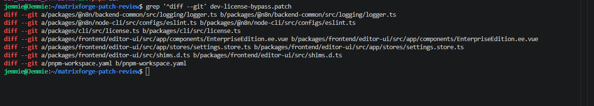
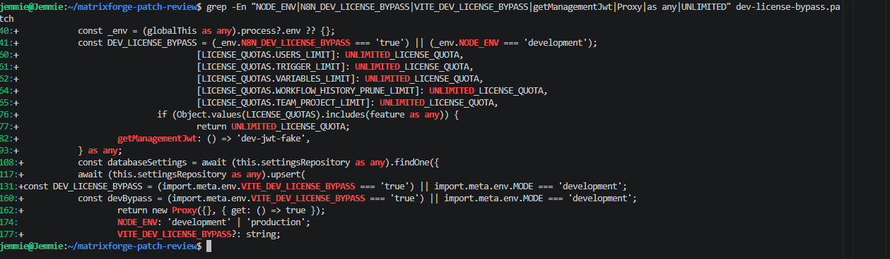
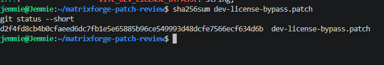

# MatrixForgeLabs Patch — Static Assessment

## Scope

This assessment reviews the supplied MatrixForgeLabs n8n development licence-bypass repository without executing its scripts or modifying the validated n8n environment.

| Item | Value |
|---|---|
| Repository | `MatrixForgeLabs/n8n-dev-license-bypass` |
| Reviewed commit | `4e69096875a618d894a11b995c5658214f400e68` |
| Patch SHA-256 | `d2f4fd8cb4bcfaeed6dc7fb1e5e65885b96ce549993d48dcfe7566ecf634d6b` |
| Documented target | n8n `1.119.0` |
| Evaluation baseline | n8n `2.36.7` |
| Review method | Read-only static analysis |

## Compatibility Finding

The patch documentation identifies n8n `1.119.0` as the compatible version and requires Node.js `20.x–24.x` with pnpm `10.x`.

The validated environment uses n8n `2.36.7`. This major-version difference means the patch cannot be considered compatible without redevelopment and full regression testing. Patch conflicts and build failures are therefore an expected risk.

## Modified Components

The patch changes seven areas:

- Backend logging
- ESLint configuration
- Core licence management
- Enterprise UI rendering
- Frontend feature settings
- TypeScript environment declarations
- pnpm workspace dependencies

## Key Risks

| Risk | Impact |
|---|---|
| Development-mode fallback | The bypass may activate without the explicit bypass variable |
| Fake licence manager | Normal entitlement validation is replaced |
| Unlimited quotas | Product limits are overridden |
| Fake management JWT | Components expecting valid licence data may fail |
| Frontend proxy | Features may appear enabled without working backend services |
| Broad `any` casts | Type incompatibilities may be hidden until runtime |
| Dependency changes | Build reproducibility and supply-chain exposure increase |
| Version mismatch | Upgrades may cause conflicts or silent failures |
| Unsupported custom build | Vendor support and maintainability are reduced |

## Integrity Verification

The reviewed patch was identified by SHA-256, and `git status --short` returned no output. This confirms the cloned source remained unchanged during the assessment.

## Conclusion

The clean n8n `2.36.7` baseline remains stable and unchanged. The supplied patch targets n8n `1.119.0` and introduces significant compatibility, security and maintenance risks.

The patch was not applied to the validated environment; therefore, Enterprise-feature activation and post-patch stability remain unverified.